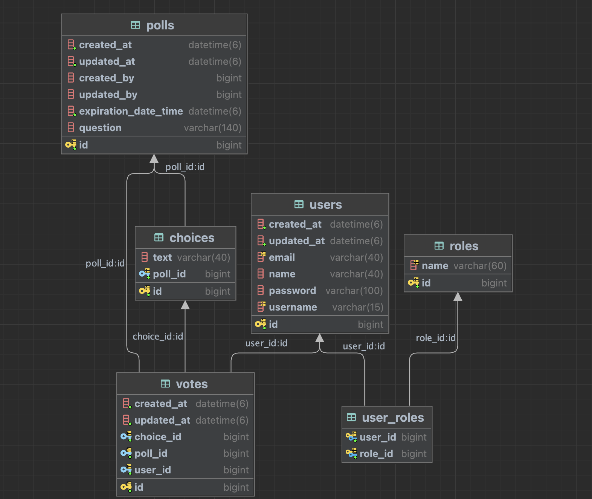
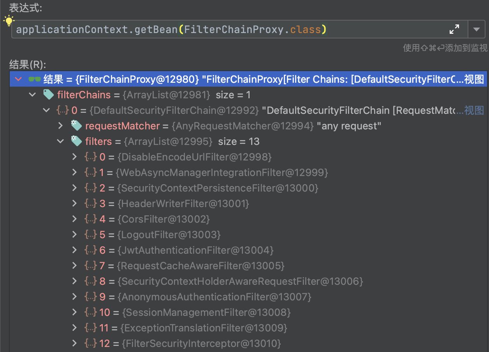

# Polling App

## 后端 

Spring Boot + MySQL + Spring Security + JWT + Spring Data JPA

### 项目结构

```markdown
Polling App
├── main
│   ├── config
│   │   ├── AuditingConfig
│   │   │   ├── AuditingConfig
│   │   │   └── SpringSecurityAuditAwareImpl
│   │   ├── SecurityConfig
│   │   └── WebMvcConfig
│   ├── controller
│   │   ├── AuthController
│   │   ├── PollController
│   │   └── UserController
│   ├── entity
│   │   ├── Choice
│   │   ├── ChoiceVoteCount
│   │   ├── Poll
│   │   ├── Role
│   │   ├── RoleName
│   │   ├── User
│   │   ├── Vote
│   │   └── Audit
│   │       ├── DateAudit
│   │       └── UserDateAudit
│   ├── exception
│   │   ├── AppException
│   │   ├── BadRequestException
│   │   └── ResourceNotFoundException
│   ├── payload
│   │   ├── ApiResponse
│   │   ├── ChoiceRequest
│   │   ├── ChoiceResponse
│   │   ├── JwtAuthenticationResponse
│   │   ├── LoginRequest
│   │   ├── PagedResponse
│   │   ├── PollLength
│   │   ├── PollRequest
│   │   ├── PollResponse
│   │   ├── SignUpRequest
│   │   ├── UserIdentityAvailability
│   │   ├── UserProfile
│   │   ├── UserSummary
│   │   └── VoteRequest
│   ├── repository
│   │   ├── PollRepository
│   │   ├── RoleRepository
│   │   ├── UserRepository
│   │   └── VoteRepository
│   ├── security
│   │   ├── CurrentUser
│   │   ├── CustomUserDetailsService
│   │   ├── JwtAuthenticationEntryPoint
│   │   ├── JwtAuthenticationFilter
│   │   ├── JwtTokenProvider
│   │   └── UserPrincipal
│   ├── service
│   │   └── PollService
│   ├── repository
│   │   ├── AppConstants
│   │   └── ModelMapper
│   └── PollingAppApplication
├── resources
│   ├── application.yml
│   └── data.sql

```



### 项目依赖

```xml
    <dependencies>
        <!-- For Working with Spring Data JPA -->
        <dependency>
            <groupId>org.springframework.boot</groupId>
            <artifactId>spring-boot-starter-data-jpa</artifactId>
        </dependency>
        <!-- For Working with Lombok -->
        <dependency>
            <groupId>org.projectlombok</groupId>
            <artifactId>lombok</artifactId>
            <version>1.18.26</version>
        </dependency>
        <!-- For Working with Spring Security -->
        <dependency>
            <groupId>org.springframework.boot</groupId>
            <artifactId>spring-boot-starter-security</artifactId>
        </dependency>
        <!-- For Working with Spring Validation -->
        <dependency>
            <groupId>org.springframework.boot</groupId>
            <artifactId>spring-boot-starter-validation</artifactId>
        </dependency>
        <!-- For Working with Spring Web -->
        <dependency>
            <groupId>org.springframework.boot</groupId>
            <artifactId>spring-boot-starter-web</artifactId>
        </dependency>
        <!-- For Working with MySQL Database -->
        <dependency>
            <groupId>com.mysql</groupId>
            <artifactId>mysql-connector-j</artifactId>
            <scope>runtime</scope>
        </dependency>
        <!-- For Working with Spring Test -->
        <dependency>
            <groupId>org.springframework.boot</groupId>
            <artifactId>spring-boot-starter-test</artifactId>
            <scope>test</scope>
        </dependency>
        <dependency>
            <groupId>org.springframework.security</groupId>
            <artifactId>spring-security-test</artifactId>
            <scope>test</scope>
        </dependency>
        <!-- For Working with Json Web Tokens (JWT) -->
        <dependency>
            <groupId>io.jsonwebtoken</groupId>
            <artifactId>jjwt-api</artifactId>
            <version>0.11.2</version>
        </dependency>
        <dependency>
            <groupId>io.jsonwebtoken</groupId>
            <artifactId>jjwt-impl</artifactId>
            <version>0.11.2</version>
            <scope>runtime</scope>
        </dependency>
        <dependency>
            <groupId>io.jsonwebtoken</groupId>
            <artifactId>jjwt-jackson</artifactId>
            <version>0.11.2</version>
            <scope>runtime</scope>
        </dependency>
        <!-- For Java 8 Date/Time Support -->
        <dependency>
            <groupId>com.fasterxml.jackson.datatype</groupId>
            <artifactId>jackson-datatype-jsr310</artifactId>
        </dependency>
    </dependencies>
```

### 项目配置

```yaml
## Server Properties
server:
  port: 7986

app:
	## JWT Properties
  jwtSecret: 9a02115a835ee03d5fb83cd8a468ea33e4090aaaec87f53c9fa54512bbef4db8dc656c82a315fa0c785c08b0134716b81ddcd0153d2a7556f2e154912cf5675f
  jwtExpirationInMs: 604800000
  ## Cors Properties
  cors:
    allowedOrigins: http://localhost:3000

spring:
  ## Spring DATASOURCE (DataSourceAutoConfiguration & DataSourceProperties)
  datasource:
  	## MySQL Properties
    driver-class-name: com.mysql.cj.jdbc.Driver
    url: jdbc:mysql://localhost/poll?useSSL=false&serverTimezone=UTC&useLegacyDatetimeCode=false
    username: root
    password: Kabi123.
  jpa:
    show-sql: true
    ## Hibernate Properties
    hibernate:
      ddl-auto: update
      # The SQL dialect makes Hibernate generate better SQL for the chosen database
      dialect: org.hibernate.dialect.MySQL5InnoDBDialect
  sql:
    init:
      # Initialize the datasource with available DDL and DML scripts
      mode: always
  ## Jackson Properties
  jackson:
    serialization:
      WRITE_DATES_AS_TIMESTAMPS: false
    time-zone: UTC

## Hibernate Logging
logging:
  level:
    org.hibernate.SQL: DEBUG
```

```yaml
hibernate:
  ddl-auto: update ## 根据Entity/Table注解识别并自动创建/更新数据库
jackson:
  erialization:
    WRITE_DATES_AS_TIMESTAMPS: false ## 防止jackson库将时间序列化为时间戳
```

### Spring Security + JWT 用户注册/登录及鉴权

##### JWT验证流程


##### SpringSecurity认证流程




